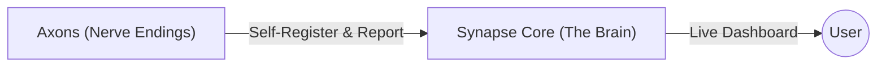

# Synapse

**The nervous system of your homelab.**

Synapse is an open-source, self-hosted infrastructure platform designed for homelabs. It acts as a central dashboard where **Axons** (clients) self-register via MQTT, providing a "Push-based" alternative to traditional static dashboards.

  

## Features

*   **Self-Registration**: Axons announce themselves. No more editing YAML config files for the dashboard.
*   **Live Status**: Real-time updates via MQTT WebSockets.
*   **TTL Monitoring**: Automatic "Offline" detection if an Axon stops reporting.
*   **Single Binary**: Synapse Core (Go), Database (SQLite), Broker (MQTT), and Frontend (Vue) all in one executable.

### Architecture



The system consists of two main components:

1.  **Synapse Core**: The central brain.
    *   **Backend**: Go (Golang)
    *   **DB**: SQLite (Embedded, WAL mode)
    *   **Broker**: Mochi MQTT (Embedded)
    *   **Frontend**: Vue 3 + Tailwind CSS + Pinia
2.  **Axons**: The nerve endings (clients).
    *   Small scripts or sidecars running alongside your services.
    *   Report status and stats via MQTT.

## Quick Start

### 1. Docker (Recommended)

The easiest way to run Synapse is using Docker Compose.

```bash
# 1. Clone the repo
git clone https://github.com/wbw1537/synapse.git
cd synapse

# 2. Start the application
docker-compose up -d
```

### 2. Build from Source

Requirements: Go 1.25+, Node.js 20+

```bash
# 1. Clone the repo
git clone https://github.com/wbw1537/synapse.git
cd synapse

# 2. Build the Frontend
cd web
npm install
npm run build
cd ..

# 3. Build the Backend (embeds frontend)
go build -o synapse cmd/synapse/main.go

# 4. Run
./synapse
```

The dashboard will be available at **http://localhost:8080**.

### 2. Configuration

Synapse looks for a `.env` file in the working directory. You can copy the example to start:

```bash
cp .env.example .env
```

| Variable                | Default             | Description                                      |
|:------------------------|:--------------------|:-------------------------------------------------|
| **Core**                |                     |                                                  |
| `SYNAPSE_HTTP_PORT`     | `:8080`             | Port for the Web UI and HTTP API.                |
| `SYNAPSE_MQTT_PORT`     | `:1883`             | TCP Port for the embedded MQTT Broker.           |
| `SYNAPSE_WS_PORT`       | `:8083`             | WebSocket Port for MQTT (used by UI).            |
| `SYNAPSE_DB_PATH`       | `synapse.db`        | Path to the SQLite database file.                |
| **Security**            |                     |                                                  |
| `SYNAPSE_AUTH_TOKEN`    | `synapse-secret`    | PSK for service registration.                    |
| **Notifications**       |                     |                                                  |
| `SYNAPSE_ENABLE_ALERTS` | `false`             | Enable SMTP email notifications.                 |
| `SYNAPSE_SMTP_HOST`     |                     | SMTP Server Hostname (e.g., smtp.gmail.com).     |
| `SYNAPSE_SMTP_PORT`     | `587`               | SMTP Port (587 for STARTTLS).                    |
| `SYNAPSE_SMTP_USER`     |                     | SMTP Username.                                   |
| `SYNAPSE_SMTP_PASS`     |                     | SMTP Password.                                   |
| `SYNAPSE_SMTP_FROM`     | `synapse@localhost` | Sender email address.                            |
| `SYNAPSE_SMTP_TO`       |                     | Comma-separated list of recipient emails.        |

Use this to export the environment variables.

```sh
export $(grep -v '^#' .env | xargs)
```

## Usage

### Running an Axon

Axons are the clients that report data to Synapse. We provide a sample Python Axon that monitors memory usage and simulates a critical alert.

**1. Install Dependencies**
```bash
pip install paho-mqtt psutil
```

**2. Run the Axon**
```bash
python3 examples/memory_axon.py
```

**What happens?**
The script will register a "Memory Monitor" service on the dashboard and cycle through a simulation:
1.  **Normal (10s)**: Reports ~45% memory usage.
2.  **Critical (5s)**: Simulates a spike to 95%, triggering a "Critical" alert on the dashboard.
3.  **Normal (Resumed)**: Returns to normal reporting.

You can modify this script to monitor your own actual services.

### Manual Registration

You can also manually register an Axon using **MQTT** (preferred) or **HTTP**.

**Option A: MQTT**
```python
import paho.mqtt.publish as publish
import json

payload = {
    "api_version": "v1",
    "auth_token": "synapse-secret",
    "id": "my-service",
    "name": "My Service",
    "status": "online",
    "ttl": 30
}

publish.single("synapse/v1/discovery/my-service", json.dumps(payload), hostname="localhost")
```

**Option B: HTTP (Curl)**
```bash
curl -X POST http://localhost:8080/api/v1/discovery \
  -d '{"id": "my-service", "name": "My Service", "status": "online", "ttl": 30, "auth_token": "synapse-secret"}'
```

See [docs/sidecar_guide.md](docs/sidecar_guide.md) for detailed integration guides.

## Troubleshooting

### SMTP / Email Alerts
*   **Port 587**: Synapse assumes `STARTTLS` when using port 587. It connects via plain TCP first, then upgrades.
*   **Port 465**: Implicit SSL/TLS is currently *not* supported by the default `net/smtp` implementation used here.
*   **Auth Failed**: If you see `SASL PLAIN authentication failed`, verify your password is correct in `.env` (ensure no trailing spaces) and that your SMTP server accepts Plain Auth from your IP.

## License

MIT

