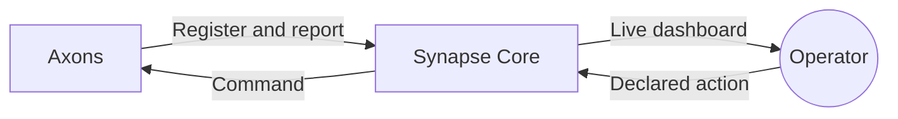

# Synapse documentation

Synapse is a self-hosted operations dashboard for a trusted homelab. Axons push
service health and metrics to the core and handle declared actions. The core
combines the dashboard, MQTT broker and SQLite in one binary.

## Run Synapse

Start with [installation](getting-started.md), then consult the
[configuration reference](configuration.md), [access policy](access.md) and
[operations guide](operations.md).

## Integrate a service

The [Python SDK guide](python-sdk.md) explains installation and the client API.
The [TOML reference](axon-toml.md) defines cards and capabilities; the
[discovery protocol](protocol.md) is the contract for other clients.

## Current scope

Synapse is an Alpha for a trusted homelab. It provides full service snapshots,
TTL offline detection, bounded logs, monitor alerts and predefined action dispatch.
For authentication and deployment limits, read the [access policy](access.md).

This website is the single user-facing instruction reference. Its source lives
in [website/docs](https://github.com/wbw1537/Synapse/tree/main/website/docs).
Development workflow, decisions and acceptance records live in the repository's
[internal docs](https://github.com/wbw1537/Synapse/tree/main/docs).
